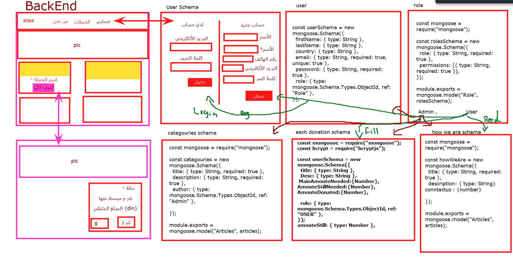

<p align="center">
  <a  rel="noopener">
 </a>
</p>

<h3 align="center">Ataa Relief</h3>

---

<p align="center"> Ataa its Relief for collecting donations.
    <br> 
</p>

## 📝 Table of Contents

- [About](#about)
- [Getting Started](#getting_started)
- [Usage](#usage)
- [Built Using](#built_using)
- [Guided By](#guided_by)

## 🧐 About <a name = "about"></a>

Giving promotes feelings of happiness.

Helping others feels good. When you donate to our Atta relief or other  charity that is important to you, you not only help them continue their vital work, but you're also improving your emotional wellbeing, a win-win situation, and helping other people  complement their main needs in life 

Donating to Ataa relif the causes you care about not only benefits the charities themselves but can also be deeply rewarding for you too. Millions of people give to charity on a regular basis to support causes they believe in, as well as for the positive effect it has on their own lives

## 🏁 Getting Started <a name = "getting_started"></a>

These instructions will get you a copy of the project up and running on your local machine for development and testing purposes.

### Prerequisites

 Software need to install and how to install them:


1. Visual Studio Code follow this  <a href="https://visualstudio.microsoft.com/vs/">link</a> to install.


2. Git Bash follow this <a href="https://git-scm.com/downloads">link</a> to install.

3. MongoDB follow this <a href="https://www.mongodb.com/try/download/community">link</a> to install.

4. Node.js follow this <a href="https://nodejs.org/en/download/">link</a> to install.


### Installing

A step by step series of examples that tell you how to get a development env running.

1. Clone the repo to your local machine using git bash

```
git clone https://github.com/C5-FouadHijazi/MERAKI_Academy_Project_4.git

```
2. install packges repeat this in backend and front end folder

```
npm i
```
3. run both server using bash Backend :

```
npm run dev
```
4. run both server using bash Frontend :

```
npm run start
```
- now app ready to use 

```
App :https://45d4-78-163-102-232.eu.ngrok.io/Home
```


## 🎈 Usage <a name="usage"></a>

1. If you only want to browse the app, All you need to swipe between pages hope we inspire you to give some help to others.
2. If you are inspired to donate, All you need to follow these steps :
- Make an account by clicking on Sign-Up > put all your information needed.

- Go to the login page by clicking on Login at the header.
- Go to campaigns and choose the one you wish to donate to.
- Inter the amount you want to donate within the specific input filed.
- Click on donate button.
- inter your credit card details and pay.
- May Allah grand your gives.

##  Data Flow <a name = "data_fkow"></a>




## ⛏️ Built Using <a name = "built_using"></a>

- [MongoDB](https://www.mongodb.com/) - Database
- [Express JS](https://expressjs.com/) - Server Framework
- [React JS](https://https://reactjs.org/) - Web Framework
- [Node JS](https://nodejs.org/en/) - Server Environment


##  User Story <a name = "user_story"></a>

follow this link <a href="https://trello.com/b/r1wlKLsO/ataareliefme" >Trello</a>

## ⚠️ Guided By <a name = "guided_by"></a>

This project is guided by ©️ **[MERAKI Academy](https://www.meraki-academy.org)**

